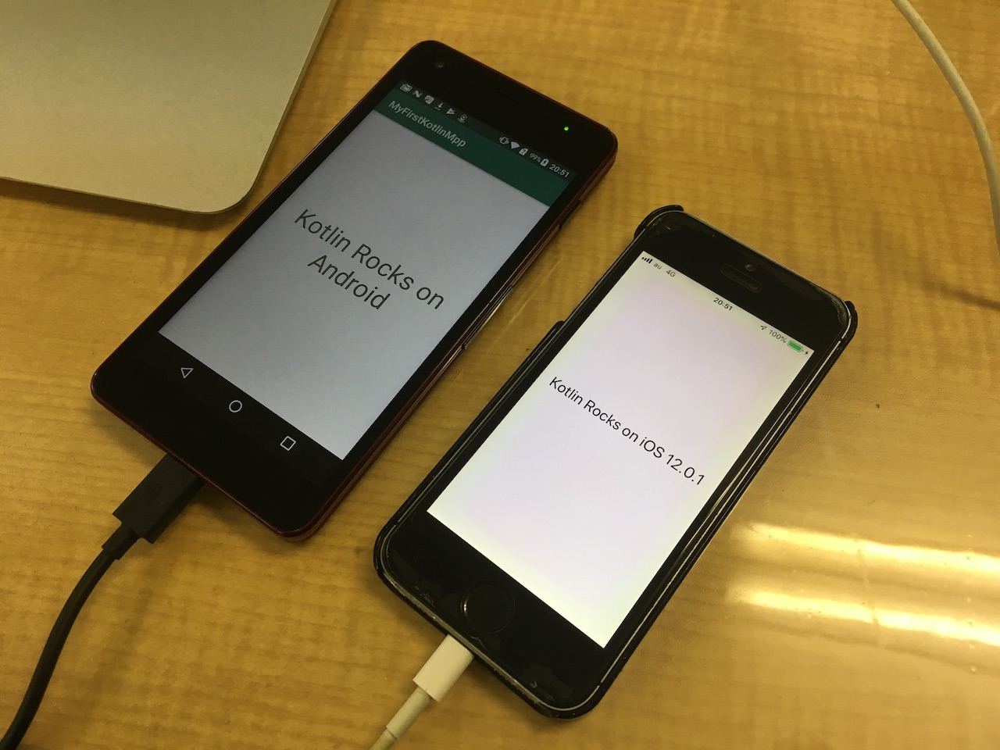

MyFirstKotlinMpp
==========

I challenged [Multiplatform Project: iOS and Android](https://kotlinlang.org/docs/tutorials/native/mpp-ios-android.html). This repository is the result.

Folder Structure
----------

This project is based on the project for Android application. Therefore, the `/app` folder is an ordinary Android application.

The `SharedCode` folder is a Gradle Module that stores common code. Also platform-specific `actual` codes is inside of here.

The `native` folder is just a folder, not a Gradle Module. It has Xcode project for iOS.